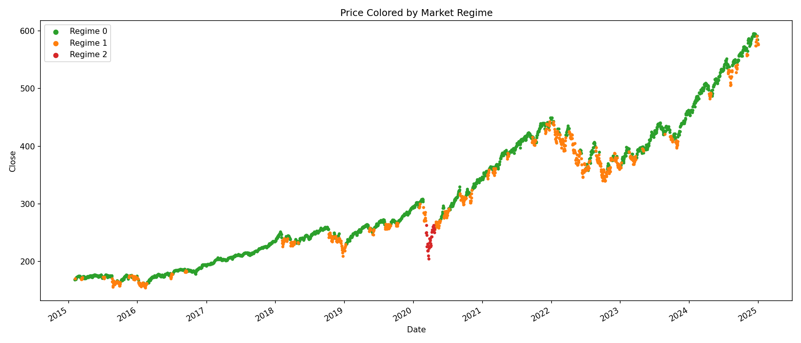
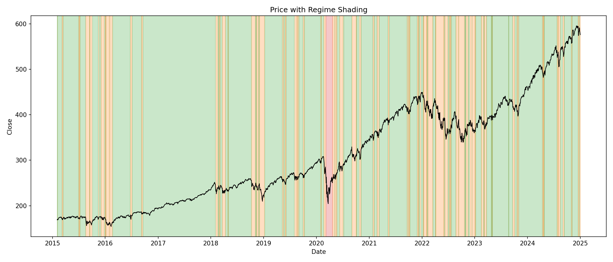
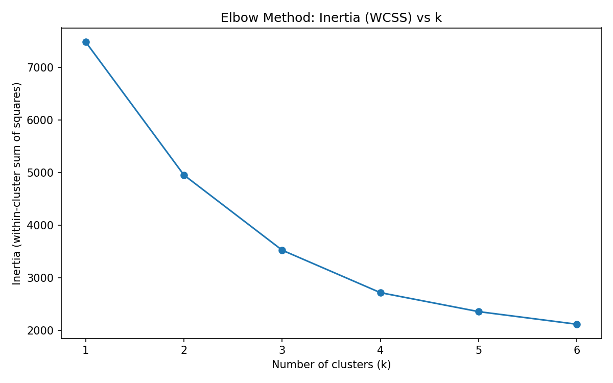

# Regime-Switching Market Classifier

Unsupervised identification of bull, correction, and crash regimes in S&P 500 (SPY) price data using K-Means clustering — implemented from scratch in NumPy, no scikit-learn in the core algorithm.

## Why This Project

Quantitative strategies don't run with fixed parameters across all market conditions — position sizing, volatility targeting, and risk limits all change depending on whether markets are calm or turbulent. Before a strategy can adapt to a regime, something has to *detect* the regime in the first place. This project builds that detection layer from first principles: no labeled data, no `sklearn.cluster.KMeans` — just raw price data, hand-engineered features, and a clustering algorithm built line by line to understand exactly what it's doing and why.

This project pairs with a separate [Stock Volatility Predictor](#) project (supervised, walk-forward validated regression) — together they cover both the supervised and unsupervised sides of a quant's typical toolkit.

## What It Does

1. Pulls 10 years of daily SPY price data (2015–2025)
2. Engineers three features per day: 5-day realized volatility, 21-day realized volatility, 10-day moving average return
3. Standardizes features (custom `StandardScaler`, mean 0 / std 1)
4. Clusters days into k=3 regimes using a from-scratch `KMeans` implementation
5. Validates the clusters against real, independently known market history
6. Visualizes price colored/shaded by detected regime

## Results

K-Means separated the data into three regimes with no time or label information ever given to the model:

| Regime | Days | 5d Vol | 21d Vol | Avg 10d Return | Interpretation |
|---|---|---|---|---|---|
| 0 | 1,846 | 0.006 | 0.007 | +0.0016 | Calm, steady growth |
| 1 | 617 | 0.015 | 0.013 | −0.0023 | Choppy / correction |
| 2 | 32 | 0.046 | 0.047 | −0.0015 | Crash |

**The key validation:** the 32 days assigned to the high-volatility cluster fall *entirely* within March 9 – April 22, 2020 — the COVID market crash — with zero false positives anywhere else in a 10-year span. The model was never given dates; it found this purely from the shape of volatility and returns.




## Choosing k: An Honest Look at the Elbow Method

The textbook approach is to pick k where the inertia (WCSS) curve "elbows." In practice, this curve rarely bends as cleanly as tutorials suggest, and this project is no exception:



| k | Inertia |
|---|---|
| 1 | 7485.0 |
| 2 | 4956.1 |
| 3 | 3528.0 |
| 4 | 2720.9 |
| 5 | 2360.5 |
| 6 | 2120.8 |

There is no single sharp bend — the curve decays smoothly, with diminishing (but non-zero) returns all the way to k=6. **Inertia alone does not unambiguously justify k=3.** What does justify it is that k=3 produces three cleanly interpretable, real-world-validated regimes (calm / choppy / crash), and the crash cluster maps almost perfectly onto a known historical event. Picking k should be a combination of the elbow heuristic *and* whether the resulting clusters mean something — this project leans on the latter more than the former, and says so directly rather than presenting the elbow as sharper than it is.

## From-Scratch Implementation Details

**`KMeans`** (`k_means.py`)
- Centroid initialization: random distinct rows sampled from the data (avoids initializing in empty regions of feature space)
- Assignment step: vectorized squared-Euclidean distance via NumPy broadcasting (`X[:, None, :] - centroids`), no Python-level loops over data points
- Update step: new centroid = mean of assigned points per cluster, with an explicit guard against empty clusters (falls back to the previous centroid rather than producing `NaN`)
- Convergence: stops early once centroid movement drops below a tolerance (`tol=1e-4`, chosen relative to standardized feature scale), capped by `max_iters` as a safety net
- Includes an `inertia()` method (WCSS) for elbow-method comparison across k

**`StandardScaler`** (`scaler.py`)
- Standard `(x - mean) / std` per feature, fit on the training data
- Guards against divide-by-zero for any constant-variance feature

## Why Scaling Matters Here

K-Means measures similarity via raw Euclidean distance. Without scaling, features with larger numeric ranges dominate the distance calculation regardless of whether they're actually more informative. Since `vol_5d`, `vol_21d`, and `ma_return_10d` all live on different natural scales, standardizing them first is not optional — it's what lets each feature contribute proportionally to cluster assignment.

## Caveats & Limitations

- **Regime meaning may not be stationary.** A "crash" cluster fit on a decade that includes 2008-scale volatility could look quite different from one fit on a calmer window. This project's crash regime is calibrated to 2015–2025 SPY data specifically.
- **The elbow method here is inconclusive on its own** (see above) — k was chosen with domain validation as the deciding factor, not inertia alone.
- **Cluster labels (0/1/2) are arbitrary and can permute** between runs with different random seeds. Always confirm regime identity by reading feature means, never by assuming a fixed index means a fixed regime.
- This is a descriptive/exploratory tool, not a trading signal — it identifies regimes *after* they've occurred using a rolling window, so there is inherent lag in any real-time application.

## Project Structure

```text
regime_classifier/
├── data/                  # Raw/cached financial datasets (e.g. SPY CSVs)
├── outputs/               # Saved plots and visualization results
├── notebooks/             # Jupyter notebooks for experimentation
│   └── regime_analysis.ipynb
├── data_loader.py         # Fetches and cleans historical price data (yfinance)
├── features.py            # Rolling volatility & return feature engineering
├── scaler.py               # Custom StandardScaler (from scratch)
├── k_means.py               # Custom K-Means clustering (from scratch)
├── analysis.py               # Elbow method, cluster profiling
├── visualize.py                # Regime scatter plots & shaded-band charts
├── main.py                      # End-to-end pipeline script
├── requirements.txt              # Project dependencies
└── README.md                      # Project documentation
```

## Running It

```bash
pip install -r requirements.txt

python main.py
# or, for the full walkthrough with plots inline:
jupyter notebook notebooks/regime_analysis.ipynb
```

## Key Learnings

- Vectorizing K-Means' distance computation via broadcasting (`(n_samples, 1, n_features) - (k, n_features)`) avoids nested Python loops entirely and is the single most important performance detail in the implementation.
- Empty-cluster handling is a real edge case, not a theoretical one — without a guard, a poorly initialized centroid can silently produce `NaN` and corrupt every subsequent iteration.
- The elbow method is a useful heuristic, not a proof — real justification for a choice of k should include whether clusters are interpretable and validate against ground truth where any exists.
- Feature scaling isn't a formality for distance-based methods — it directly determines which features the algorithm "listens to."